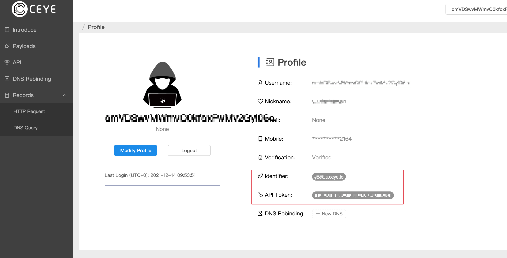
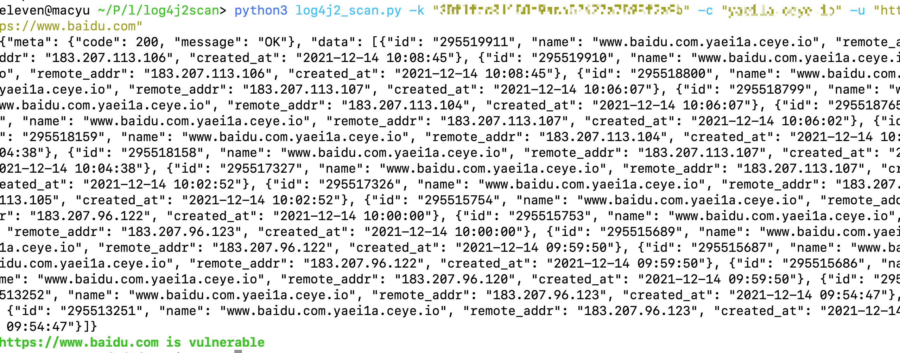
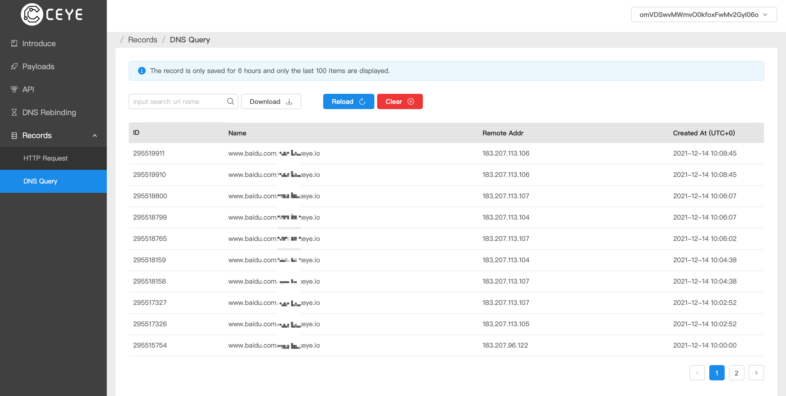
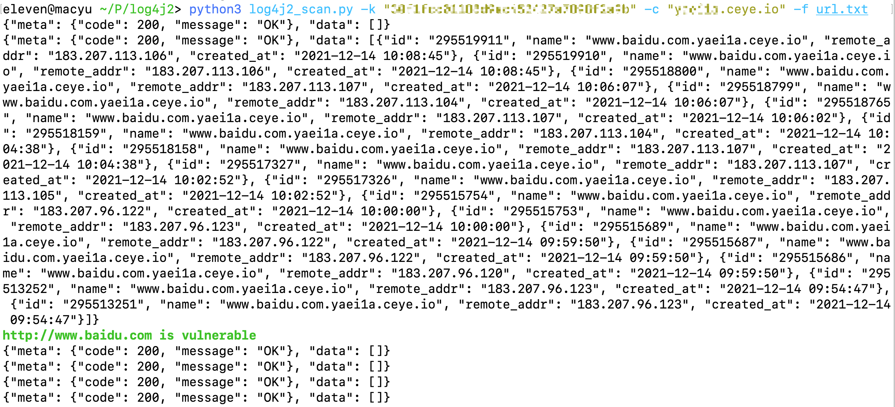

# log4j2scan 批量扫描脚本

随便写写，好像发现了百度还未完全修复。。。。

检测的DNSLog 基于 http://ceye.io ，需要如下信息Identifier  与 API Token



### 单个url 扫描

```
python3 log4j2_scan.py -k "xxxxxxx" -c "xxxxx.ceye.io" -u https://www.baidu.com
```




发现虽然请求了一次，但过一段时间DNSLog会收到好几个请求：



### 批量扫描 

```
python3 log4j2_scan.py -k "xxxxxxx" -c "xxxxx.ceye.io" -f url.txt
```




